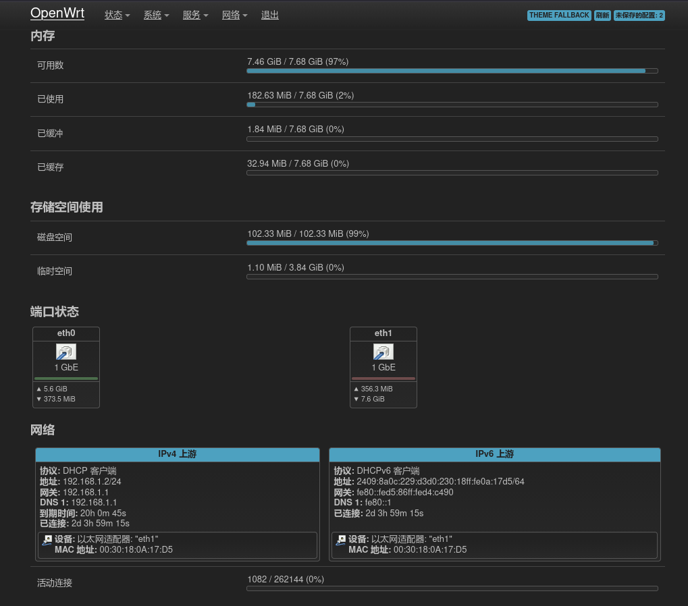
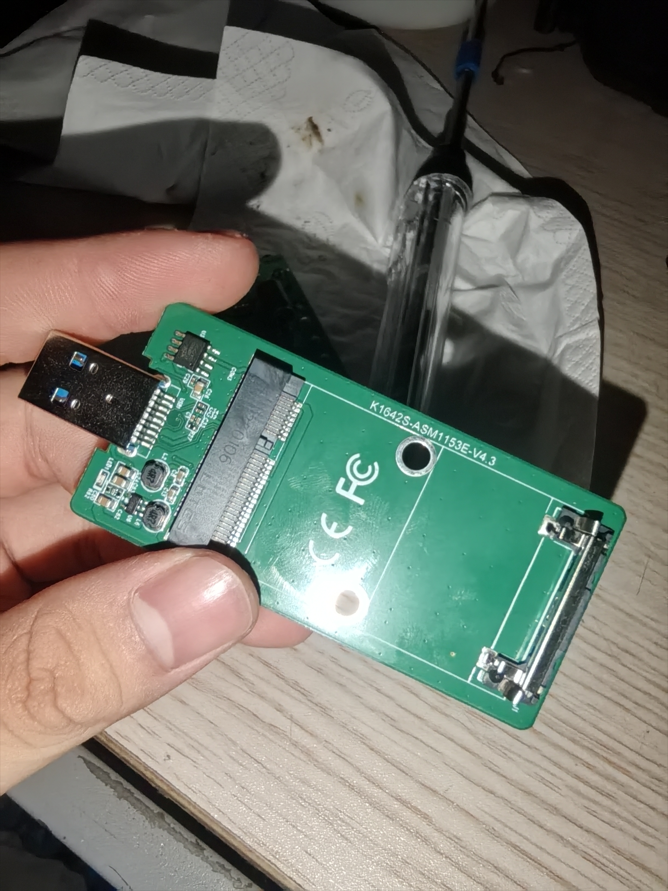
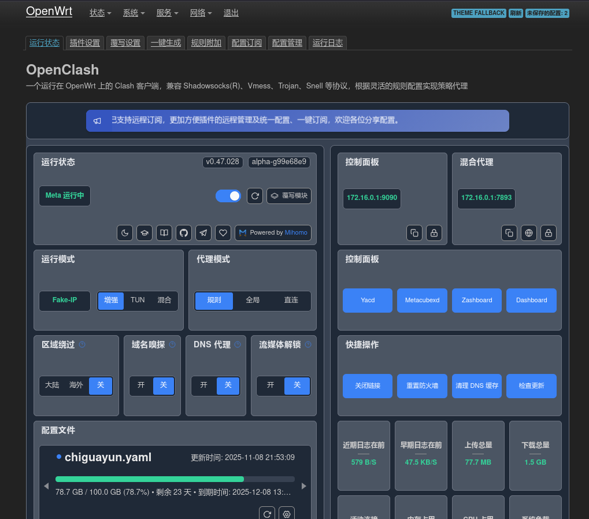
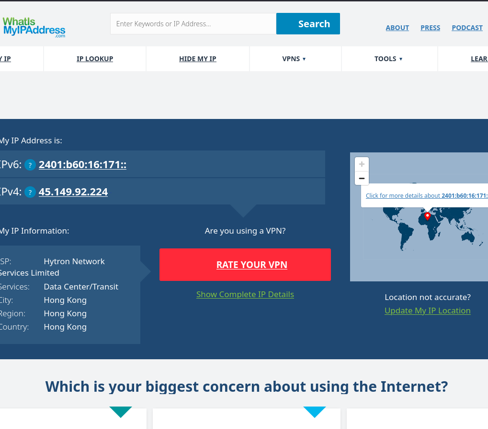
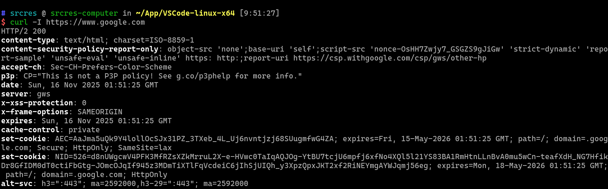

# 实验三 IPSec VPN

Author: Haowen Hu

Student ID: 2023002089

# 实验目的和要求

掌握如何配置站点到站点 IPSec VPN.

# 实验内容

"站点到站点" 是 VPN 的一种主要的连接方式, 用于加密站点间的流量.

在本实验中, 笔者将通过演示如何基于 Clash 协议建立站点到站点 VPN, 并通过该 VPN 绕过某些网络限制访问一般情况下无法访问到的网络资源.

# 主要软件

客户端主机安装 Clash 客户端软件, 通过客户端软件与服务器建立 Clash VPN 信道.

由于笔者有一台软路由设备, 所以打算为该设备刷入 OpenWrt 固件系统, 并在其之上安装 Clash 客户端软件以完成该实验.

# 实验步骤

1.  "工欲善其事, 必先利其器." 笔者所使用的软路由设备为从闲鱼上淘来的一块二手工控拆机主板. 下面 po 了几张这块主板的图. 可以看到该主板有两个以太网口 (这是最主要的), 处理器是 1037U (我直接从 OpenWrt Management 界面上截配置信息图了).

    
    
    
    
    

2.  给这块主板刷 OpenWrt 固件. 需要自行准备一块 mSATA 硬盘以及 USB 硬盘读写器 (如下图).

    

3.  下载 OpenWrt 固件. 注意要下 x86 ISA 版本的 (1037U 是 Intel 家的, 自然就是 x86 的), 下载 img 硬盘镜像文件, 然后在自己的桌面电脑上, 插入上好 mSATA 硬盘的 USB 读写器, 自己用工具软件把 img 文件刷入 mSATA 硬盘. (网上有很多教程, 笔者码字太累了就省略了, 详情请自行 STFW.)

4.  给硬盘刷好镜像, 再把硬盘从读写器上下下来塞回主板上. 再检查一下主板上有内存条没, 给主板插上内存条 (内存不用太大, 笔者用了根 4 GB 笔记本内存, 发现日常占用仅几百 MB... 只能说当初还是太多虑了).

5.  万事俱备, 给主板上电. 外接一个副屏和键盘, 进行 OpenWrt 固件的初始配置. 想了解具体技术细节还是 STFW 吧, 笔者当初是咋设置的也忘了...

6.  按正确步骤弄完 OpenWrt 初始设置, 确保主板能像普通一台家用路由器那样工作, 接入该路由器下面的子网设备能够通过该路由器访问到上层广域网或者 Internet, 这就算具备了基础功能. 接下来就要开始我们实验的正式部分, 配置 VPN 了.

7.  给 OpenWrt 安装 OpenClash 插件, 我们用这个插件作为 Clash 客户端. 可通过以下命令完成:

    ```sh
    opkg update
    opkg install luci-app-openclash
    ```

8.  对 OpenClash 插件进行设置. 访问 OpenWrt 的管理页面, 点选 "服务" 一栏下的 "OpenClash", 确保能够进入到 OpenClash 的设置页面. 如果进入不了或者找不到这个服务, 尝试重启软路由设备, 应该就能看到了.

    

9.  自己搭建一个 Clash 服务器进行测试. 笔者用的第三方提供的一个服务器, 自己不是太懂技术细节, 读者若感兴趣可自行 STFW 进行研究.

10. 进入到 OpenClash 设置选项页. 点击 "配置订阅", 添加一个新订阅, 把从服务器上获取到的 Clash 订阅链接粘贴进去, 然后保存配置. 随后该插件会自动根据链接从服务器获取订阅.

11. 观察到订阅配置文件加载完毕后, 回到 OpenClash 插件的设置主页 (即 "运行状态" 选项卡), 启动 OpenClash 插件.

12. 待启动完毕后, 尝试通过软路由访问某些网页, 可以发现已经能够正常地直连上去了, 而不需要在客户主机电脑上安装类似的软件了. 直接通过软路由就能访问到这些网页.

    
    
    
    
    

# 运行结果 (截屏)

见上, 已经附在文间了.

# 实验分析与心得

Clash VPN 的实验过程比较简单, 主要是对 OpenWrt 固件的安装和配置, 以及 Clash 客户端的安装和配置. 由于笔者没有相关的硬件设备, 所以无法进行实际测试, 只能靠读者的理解和实验结果来判断是否成功. 实验结果也比较直观, 能够看到 Clash 客户端的运行状态, 以及软路由的网络连接情况. 实验过程中, 读者可以多关注一下 OpenWrt 管理界面上的相关信息, 以及 OpenClash 插件的设置选项, 看看是否有什么需要注意的地方.

Clash VPN 与 IPSec VPN 的原理非常类似, 因此笔者认为, 该实验的主要目的就是熟悉 OpenWrt 固件系统的使用, 以及 Clash 客户端软件的安装和配置. 实验过程中, 笔者也遇到了一些问题, 但都通过查阅相关资料 (RTFM) 和官方文档解决了. 实验过程中, 笔者也学到了很多东西, 包括 OpenWrt 固件系统的使用方法, Clash 客户端软件的安装和配置方法, 以及 OpenClash 插件的使用方法. 实验过程中, 笔者也收获了很多知识, 包括 OpenWrt 固件系统的使用方法, Clash 客户端软件的安装和配置方法, 以及 OpenClash 插件的使用方法. 最后, 笔者也对自己所学的知识有了更深入的理解, 并对实验的结果满意.

最后, 本实验的所有内容 (含代码) 均已上传至 GitHub: https://github.com/srcres258/netsec-exp . 欢迎 Star!
