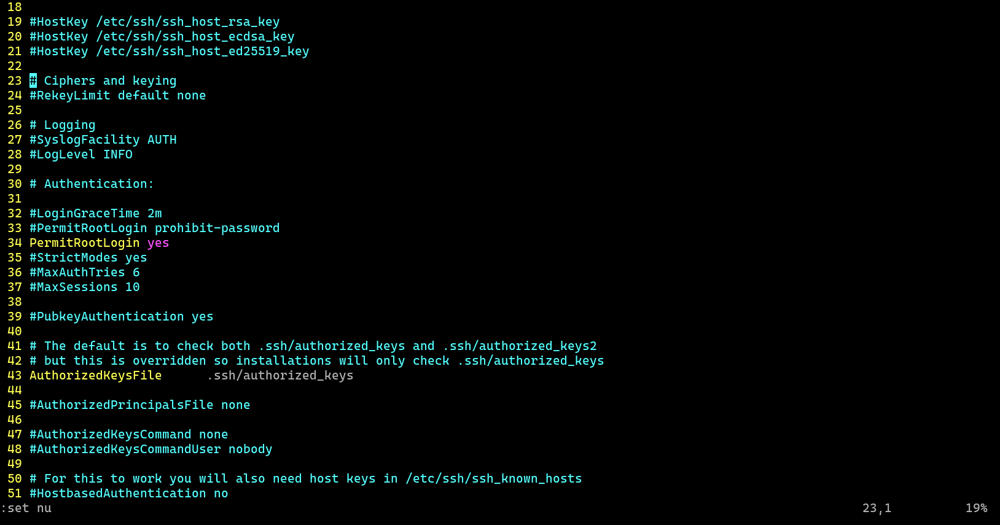
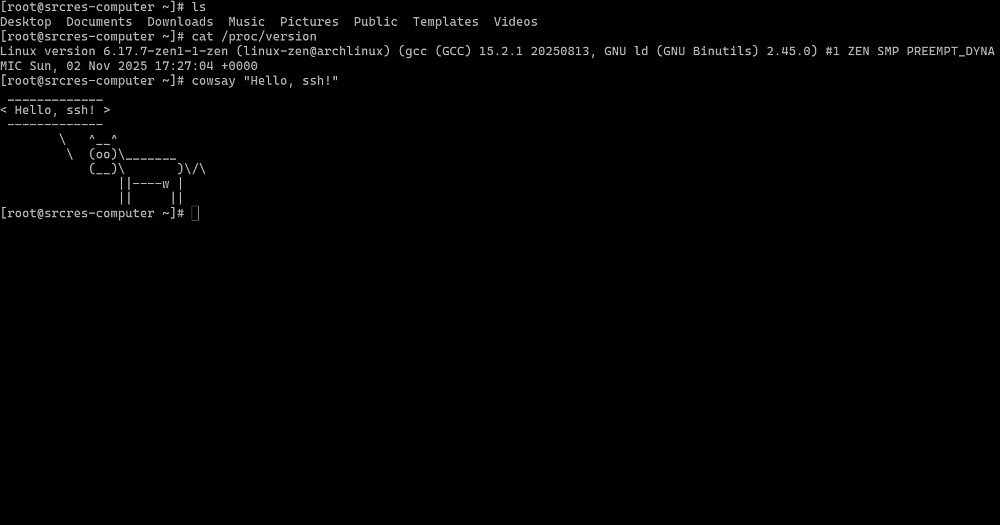

# 实验四 SSH

Author: Haowen Hu

Student ID: 2023002089

# 实验目的和要求

掌握配置和测试 SSH 协议的步骤和方法.

# 实验内容

使用 SSH 对远程登录用户进行认证.

# 主要软件

准备两台主机接入同一个局域网. 其中一台安装 Arch Linux 操作系统, 并按步骤配置好 sshd 服务.

# 实验步骤

1.  笔者打算给两台电脑主机都安装好 Arch Linux 操作系统. 先将两台电脑主机都接入局域网, 并确保局域网网关的 WAN 口已经接入 Internet.

2.  安装好 Arch Linux 操作系统, 这一步不必多说, 不懂的话请 STFW. 完成后, 选定其中一台主机作为 SSH 服务机, 它需要安装 sshd 服务以允许其他设备通过 SSH 方式进行登录. 我们选用开源的 openssh 作为 SSH 服务. 在终端中执行以下命令来安装 openssh:

    ```sh
    pacman -S openssh
    ```

3.  配置 SSH 服务. 编辑 `/etc/ssh/sshd_config` 文件, 找到并修改以下参数:

    ```
    # 允许 root 用户登录
    PermitRootLogin yes

    # 允许远程登录用户
    AllowUsers user1 user2

    # 禁止密码登录
    PasswordAuthentication no

    # 禁止空密码登录
    PermitEmptyPasswords no

    # 禁止 root 用户使用 su 命令切换用户
    PermitRootLogin no
    ```

    还可根据自身需要, 选择性地修改配置文件中其他必要的参数.

    

4.  启用并启动 SSH 服务. 在终端中执行以下命令:

    ```sh
    sudo systemctl enable sshd
    sudo systemctl start sshd
    ```

5.  测试 SSH 服务. 首先, 确保另一台主机已经安装并配置好 SSH 客户端. 笔者使用 Arch Linux 系统, 默认已经安装好的 `ssh` 命令就是一个 SSH 客户端. 笔者的另一台主机的 IP 地址是 `192.168.1.100` (需要自己去读 IP 地址信息, 获取方式既可以去看网关, 也可以用 `ip addr` 命令), 所以在另一台主机上, 执行以下命令:

    ```sh
    ssh root@192.168.1.100
    ```

6.  输入 root 用户的密码, 成功登录后, 可以看到已经成功进入到了远程主机的 root 用户的终端界面. 那尝试运行一些命令吧! 也能正确运行!

    

# 运行结果 (截屏)

见上, 已经附在文间了.

# 实验分析与心得

SSH 协议是一种基于网络的安全远程登录协议, 它可以提供基于密钥的认证方式, 使得远程登录更加安全. 本次实验中, 我们配置了 SSH 服务, 并测试了 SSH 客户端的登录功能. 实验过程中, 我们还了解了 SSH 服务的配置文件, 并掌握了如何启用和启动 SSH 服务. 最后, 我们成功地登录到远程主机的 root 用户的终端界面, 并运行了一些命令. 实验过程中, 我们还掌握了一些 SSH 相关的基本知识, 如密钥认证, 允许远程登录用户, 禁止密码登录等. 实验过程中, 我们也学到了 Arch Linux 系统的一些基本操作技巧, 如安装软件, 查看系统信息等. 总的来说, 这次实验对我们 SSH 知识的掌握和理解有很大的帮助.

最后, 本实验的所有内容 (含代码) 均已上传至 GitHub: https://github.com/srcres258/netsec-exp . 欢迎 Star!
